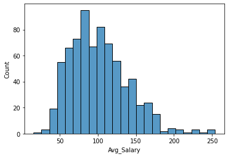
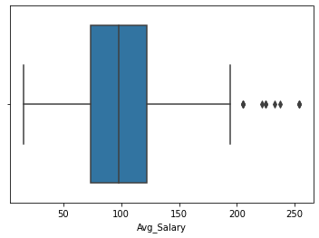
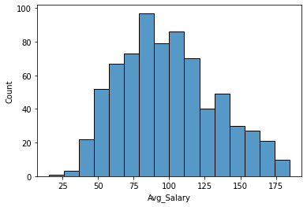
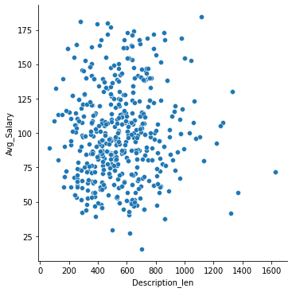
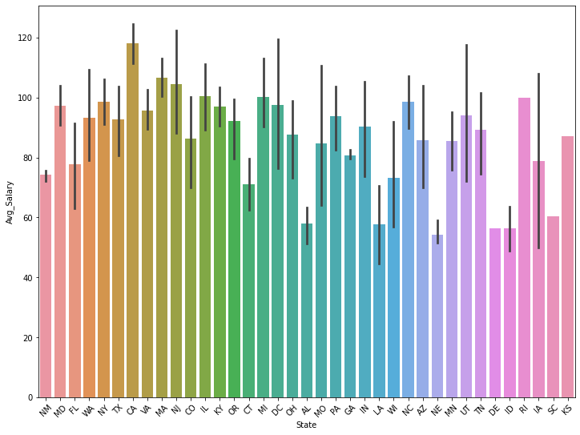
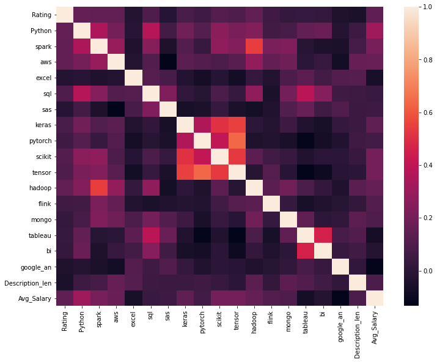

# Predicting a Data Scientist's Salary in USA using Extreme_Gradient_Boosting

We're gonna use data sourced from Glassdoor to train an Extreme Gradient Boosting Regressor to be able to predict a Data Scinetist's Average Salary depending on canditate's features.

#  _Installation_

### Use pip to install all necessary packages
- pip install pandas
- pip install numpy
- pip install matplotlib
- pip install -U scikit-learn
- pip install seaborn
- pip install xgboost
- pip install nltk
<br/>

# _The Code_
### At First we load the data from our .csv file and we do some preprocessing and feature engineering. We used the RegexTokenizer to extract all words within the job description in order to create a new feature. We used  the number of words used in each description to create the column 'Description_len'.
<br/> 

```python
data = pd.read_csv('data_cleaned_2021.csv')
data = data.rename(columns = {'Avg Salary(K)' : "Avg_Salary","Job Location" : "State","Lower Salary" : "Min_Salary","Upper Salary" : "Max_Salary"})

tokenizer = RegexpTokenizer(r"\w+")
data['Description_len'] = data['Job Description'].apply(lambda x: len(tokenizer.tokenize(x)))
data['Degree'] = data['Degree'].replace('na','B')
```
<br/>    

### In order for our analysis to be right we need to look out for how our data is spread . On the histogram below we see that except the values over 190K on Avg Salary our data are normaly distributed. We can also see the outliers better using a boxplot of the Avg Salary on the second picture.
<br/>

<p float="left">
  
   
</p>

<br/> 

### Next, we re gonna remove the outliers and irrelevant data (observations with ratings < 0 ) which are on a scale of 4%, so we are not gonna lose too much data . Then check the distribution again.
<br/> 

```python
#Removing outliers
data = data[data['Avg_Salary'] < 190]
#Removing Incorrect inputs for Rating
data = data[data['Rating'] >= 0]
```
<br/>
<p float="left">
   
</p>
<br/>    

### On the following code block we re gonna inspect the salary changes across diferrent states, correlation between our new feature(Description len) and our target(Avg Salary).Then we re gonna select the data for our model and check the correlations across all of them using a heatmap.
<br/>

```python
new_data = data[['Rating',
       'State','Python', 'spark', 'aws','excel', 'sql',
       'sas', 'keras', 'pytorch', 'scikit', 'tensor', 'hadoop',
       'flink', 'mongo','Degree','tableau','bi','google_an','Description_len','Avg_Salary']]
```



 
### On the next code block we re gonna select the features and target variables, split the features in numerical and categorical and scale them respectively . Lastly combine the scaled features together. For the scaling we used StandardScaler and Pandas OneHotEncoder 
<br/>

```python
features = new_data.drop(columns = ['Avg_Salary'],axis = 1)
target = data['Avg_Salary']

num_f = features._get_numeric_data()
cat_f = features.select_dtypes('object')

scaler = StandardScaler()
scaler.fit(num_f)

scaled_num = pd.DataFrame(scaler.transform(num_f),columns = num_f.columns).reset_index(drop=True)
scaled_cats = pd.get_dummies(cat_f).reset_index(drop=True)

features_scaled = pd.concat([scaled_cats,scaled_num],axis = 1)
```


 
### Following we used PCA to reduce dimensionality of the dataset going from 58 to 23 dimensions which wields the best results(computed using GridSearchCV).After that, we split on train and test data , instantiate the XGBRegressor model using a tree model and 1000 estimators.At last we fit the train data to the model  and get the predictions on x_test.
<br/>

```python
pca = PCA(n_components = 23,whiten=True ,random_state = 23)

x_train,x_test,y_train,y_test = train_test_split(features_scaled,target , test_size = 0.2 , random_state = 23)

x_train = pca.fit_transform(x_train)
x_test = pca.transform(x_test)

xg = XGBRegressor(booster = 'gbtree',n_estimators=1000,max_depth=6,gamma = 0, eta=0.1, subsample=0.9, colsample_bytree=0.5,eval_metric =['mae'],random_state = 23)

model = xg.fit(x_train,y_train)
predictions = xg.predict(x_test)
```
### Lastly we evaluate the model using Mean Absolute Error and comparing it the the mean of the Avg Salary. Our model seems to be falling off by about 6% of the mean Avg Salary which is considered really good.
<br/>

```python
mean = target.mean()  
mae = mean_absolute_error(predictions,y_test)
print(f"Mean Avg Salary: {round(new_data['Avg_Salary'].mean(),2)} "f"\nMean Absolute Error: {round(mae,2)}")

error_ratio = round((1 -(mean - mae)/mean) * 100,2)
print(f"Prediction error ratio : {error_ratio}%")
```